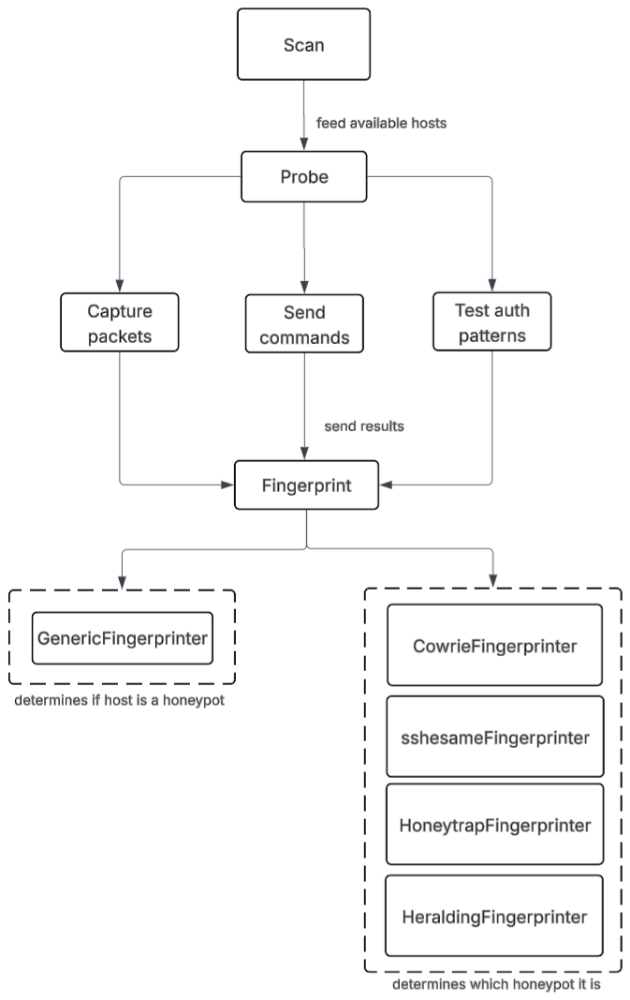

# SSH Honeypot Detection System

This tool is designed to detect and fingerprint SSH honeypots based on behavioral differences between real and simulated hosts. 
It does by running a pipeline that scans a given sub network, performs authentication attempts, interacts with hosts and compares their behavior with known deception tactics used by specific honeypots.

The workflow therefore consists of three steps: **scan**, **probe**, **analyze**. A visual representation of the steps is shown below:


## Detection Methods

1. **Banner Analysis**
   - Identifies outdated SSH versions
   - Detects known honeypot banner patterns
   - Scores based on version suspiciousness

2. **Authentication Testing**
   - Tracks success/failure patterns
   - Identifies suspicious root access
   - Detects inconsistent auth behaviors

3. **Command Response Analysis**
   - Runs a specified set of commands
   - Compares the responses with the expected behavior of a honeypot to fingerprint

## Network Scanning
The system can optionally scan the network for live hosts. The scanner incorporates a fast network scan using `ZMap` to find live hosts, which are later scanned by `NMap` to identify its Operating System, version, and distance in the network.

By default the scanner runs in Docker mode, which skips finding live hosts and proceeds with known hosts. If a scan of the network is needed. toggle the `RUNNING_IN_DOCKER` constant in `scanner.py` to be `False`. Set the `HOST_NETWORK` constant to the subnet to be scanned (ex. `192.168.1.0/24`). Now, the newly found hosts will also be evaluated using the tool.

## Usage

1. Clone the repository:
```bash
git clone --recurse-submodules git@github.com:adduta/hackinglab-team5.git
cd hackinglab-team5
git submodule update --init --recursive
```

2. Install dependencies:
```bash
pip install -r requirements.txt
```

3. Run the docker containers
```bash
docker compose up --build -d
```

4. To see the results, look into the logs of the `prober` container.

## Project Structure

```
prober/
├── src/
│   ├── modules/
│   │   ├── fingerprints/
│   │   │   ├── base_fingerprinter.py # Abstract base class for fingerprinters 
│   │   │   ├── generic_fingerprinter.py # Determines if host is a honeypot or not 
│   │   │   ├── cowrie_fingerprinter.py # Cowrie signature detection
│   │   │   ├── honeytrap_fingerprinter.py # Honeytrap signature detection
│   │   │   ├── heralding_fingerprinter.py # Heralding signature detection
│   │   │   ├── sshesame_fingerprinter.py # Heralding signature detection
│   │   ├── auth_tester.py # Authentication testing
│   │   ├── credential_manager.py  # Credential handling
│   │   ├── honeypot_fingerprinter.py  # Core detection logic
│   │   ├── scanner.py # Network scanning
│   │   └── ssh_analyzer.py # SSH response analysis
│   │   └── utils.py # Utilty functions 
│   └── probe.py  # Main entry point
```


#  Port Mapping Summary
| Container | Internal IP    | Docker Net Port | Host Port |
|-----------|----------------|-----------------|-----------|
| sshesame  | 192.168.125.40 | 2022            | 2221      |
| cowrie    | 192.168.125.30 | 2222            | 2222      |
| heralding | 192.168.125.42 | 22              | 2223      |
| debian    | 192.168.125.90 | 22              | 2224      |
| honeytrap | 192.168.125.44 | 8022            | 2225      |
